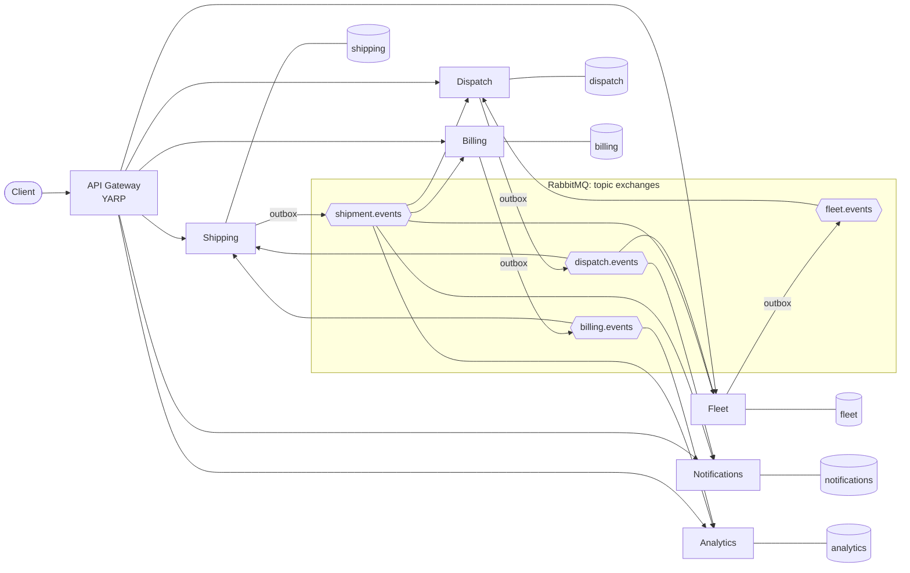
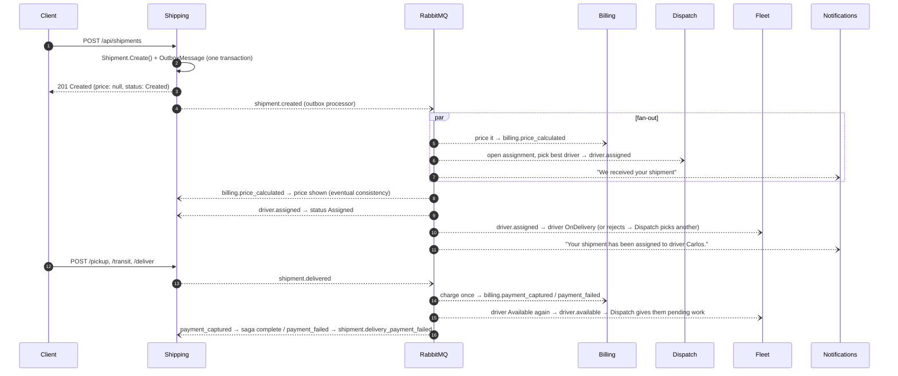

# Deliver: last-mile delivery platform

[](https://github.com/fsoftt/Deliver/actions/workflows/ci.yml)
[](https://fsoftt.github.io/Deliver/)
[](LICENSE)

**📖 Project site: https://fsoftt.github.io/Deliver/**: concepts, architecture, how it was built.

Deliver is a portfolio project (.NET backend + React UI) that shows how to split a business domain into **bounded contexts**,
build each one as an **independently deployable .NET service** that owns its data, and connect the
services with **events over RabbitMQ**, reliably.

A business creates a shipment. It is priced, assigned to an available driver, picked up, transported and
delivered, and the customer is charged. Six services take part. None of them calls another
synchronously, and none of them reads another's database.

> The goal is not a feature-rich delivery app. The goal is to show architectural judgement:
> clear boundaries, explicit domain models, asynchronous communication, independently owned data,
> resilience, observability and testability, without building infrastructure for its own sake.

---

## Contents

- [Architecture at a glance](#architecture-at-a-glance)
- [Run it](#run-it)
- [What happens when you create a shipment](#what-happens-when-you-create-a-shipment)
- [Patterns, and where to find them in the code](#patterns-and-where-to-find-them-in-the-code)
- [API](#api)
- [Testing](#testing)
- [Repository layout](#repository-layout)
- [Design decisions and trade-offs](#design-decisions-and-trade-offs)
- Deeper docs: [architecture](docs/architecture.md) · [event catalogue](docs/events.md) · [ADRs](docs/decisions)

---

## Architecture at a glance



| Bounded context | Owns | Publishes | Reacts to |
|---|---|---|---|
| **Shipping** | Shipments and their lifecycle (`Created → Assigned → PickedUp → InTransit → Delivered`, or `Cancelled`) | `shipment.*` | `driver.assigned`, `billing.price_calculated`, `billing.payment_*` |
| **Fleet** | Drivers, vehicles, availability (`Unavailable ⇄ Available → OnDelivery`) | `driver.available`, `driver.unavailable`, `driver.assignment_rejected` | `driver.assigned`, `shipment.delivered`, `shipment.cancelled` |
| **Dispatch** | Matching shipments to drivers (`DeliveryAssignment`, a local projection of drivers) | `driver.assigned` | `shipment.created/delivered/cancelled`, `driver.*` |
| **Billing** | Pricing, invoices, payments | `billing.price_calculated`, `billing.payment_captured/failed` | `shipment.created/delivered/cancelled` |
| **Notifications** | What the customer is told, and the history of it | nothing | `shipment.*`, `driver.assigned` |
| **Analytics** | A reporting read model | nothing | `shipment.*`, `billing.payment_captured` |

Every service owns its **own PostgreSQL database and login**. The init script revokes access from
everybody else, so the "no shared database" rule is enforced, not just agreed on.

## Run it

Prerequisites: Docker. The .NET 10 SDK is only needed to build or test outside containers.

```bash
docker compose up --build        # from the repository root
./scripts/demo.sh                # in another terminal: walks through the whole "Definition of Done"
```

| URL | What |
|---|---|
| http://localhost:3000 | **Web UI** (React control tower) |
| http://localhost:5000 | API gateway, the only public entry point |
| http://localhost:15672 | RabbitMQ management (`deliver` / `deliver`): exchanges, queues, retry tiers, DLQs |
| http://localhost:16686 | Jaeger: search service `api-gateway` to follow one request across every service |

[`requests/deliver.http`](requests/deliver.http) contains the same flow as clickable requests for
VS Code / Rider / Visual Studio. [`scripts/demo.sh`](scripts/demo.sh) automates it and CI runs it on every push.

<details>
<summary>Run the services from an IDE instead</summary>

Start only the infrastructure with `docker compose up postgres rabbitmq jaeger`, then run each project
under `src/` with the `Development` environment. The ports are 5000 (gateway), 5101 to 5106 (services),
and each `appsettings.json` points at `localhost`.
</details>

## What happens when you create a shipment



The client never waits for Billing, Dispatch or Notifications. If Billing is down, shipments are still
created, and the price appears when Billing catches up. That is **intentional eventual consistency**:

```jsonc
// GET /api/shipments/{id} right after creation      // ...a moment later
{ "status": "Created", "price": null }               { "status": "Assigned", "price": 13000, "currency": "CLP" }
```

## Patterns, and where to find them in the code

| Concept | What it solves | Where |
|---|---|---|
| **Aggregates and invariants** | Business rules live in the model. There are no public setters and invalid transitions throw. | [`Shipment`](src/Services/Shipping/Deliver.Shipping.Domain/Shipments/Shipment.cs), [`Driver`](src/Services/Fleet/Deliver.Fleet.Domain/Drivers/Driver.cs), [`Invoice`](src/Services/Billing/Deliver.Billing.Domain/Invoices/Invoice.cs), [`DeliveryAssignment`](src/Services/Dispatch/Deliver.Dispatch.Domain/Assignments/DeliveryAssignment.cs) |
| **Mediator pipeline (CQRS)** | Logging and validation are written once, not in every handler | Commands and queries via MediatR 12.5 (last Apache-2.0 version). [`LoggingBehavior`, `ValidationBehavior`](src/BuildingBlocks/Deliver.Application.Pipeline) with FluentValidation |
| **Value objects** | Validated concepts instead of primitives | `Address`, `Weight`, `Money`, `Vehicle`, strongly typed ids |
| **Domain service** | Logic that belongs to no single entity | [`DriverSelectionPolicy`](src/Services/Dispatch/Deliver.Dispatch.Domain/Assignments/DriverSelectionPolicy.cs), [`DeliveryPricing`](src/Services/Billing/Deliver.Billing.Domain/Pricing/DeliveryPricing.cs) |
| **Domain vs integration events** | Internal facts stay internal. Public contracts are explicit, primitive-only DTOs. | `*DomainEvent` records in each domain, then [`Publish*IntegrationEvents`](src/Services/Shipping/Deliver.Shipping.Application/IntegrationEvents/PublishShipmentIntegrationEvents.cs), then [`Deliver.Contracts`](src/BuildingBlocks/Deliver.Contracts) |
| **Transactional outbox** | Saving state and publishing can't diverge | [`DomainEventsInterceptor`](src/BuildingBlocks/Deliver.Messaging/DomainEvents/DomainEventsInterceptor.cs), [`EfOutbox`](src/BuildingBlocks/Deliver.Messaging/Outbox/EfOutbox.cs), [`OutboxProcessor`](src/BuildingBlocks/Deliver.Messaging/Outbox/OutboxProcessor.cs) (`FOR UPDATE SKIP LOCKED`, publisher confirms) |
| **Idempotent consumer (inbox)** | At-least-once delivery never means "processed twice" | [`RabbitMqConsumer.ProcessAsync`](src/BuildingBlocks/Deliver.Messaging/Consuming/RabbitMqConsumer.cs): the inbox check, the handler and the inbox insert run in one transaction, with the `(message_id, consumer)` primary key |
| **Retry with backoff and DLQ** | Transient failures heal. Poison messages are parked instead of blocking the queue. | [`Topology`](src/BuildingBlocks/Deliver.Messaging/RabbitMq/Topology.cs): TTL retry tiers `queue.retry.N` → `queue.dlq` |
| **Saga (choreography) and compensation** | A cross-service workflow without distributed transactions | Delivered → payment captured/failed. Cancelling voids the invoice, releases the driver and closes the assignment. See [architecture](docs/architecture.md#the-delivery-saga). |
| **Local projections** | No runtime queries between services | Dispatch's `Driver` pool (from Fleet events), Notifications' `ShipmentRecipient`, Analytics' `ShipmentFact` |
| **Optimistic concurrency** | Two writers can't silently overwrite each other | PostgreSQL `xmin` on every aggregate |
| **CQRS-lite** | Queries don't load aggregates | `I*ReadStore` interfaces in Application, implemented with `AsNoTracking` projections |
| **Distributed tracing and correlation** | Follow one business flow across async hops | [`CorrelationIdMiddleware`](src/BuildingBlocks/Deliver.ServiceDefaults/Correlation/CorrelationIdMiddleware.cs), with `traceparent` stored in the outbox and propagated in AMQP headers ([`MessagingDiagnostics`](src/BuildingBlocks/Deliver.Messaging/MessagingDiagnostics.cs)) |

## API

All requests go through the gateway (`http://localhost:5000`).

| Method | Path | |
|---|---|---|
| `POST` | `/api/shipments` | Create a shipment (201; price and driver arrive asynchronously) |
| `GET` | `/api/shipments/{id}` · `/api/shipments?status=&page=&pageSize=` | Query shipments |
| `POST` | `/api/shipments/{id}/pickup` · `/transit` · `/deliver` · `/cancel` | Lifecycle transitions (409 if the transition is invalid) |
| `POST` | `/api/drivers` | Register a driver with their vehicle |
| `GET` | `/api/drivers/{id}` · `/api/drivers/available` | Query drivers |
| `POST` | `/api/drivers/{id}/availability` | Start or end a shift `{ "available": true }` |
| `PUT` | `/api/drivers/{id}/vehicle` | Change vehicle |
| `GET` | `/api/dispatch/assignments?status=` · `/api/dispatch/assignments/{shipmentId}` | Dispatch decisions |
| `GET` | `/api/billing/shipments/{shipmentId}` · `.../invoice` | Price, invoice and payment attempts |
| `GET` | `/api/notifications?shipmentId=&customerId=` | Notification history |
| `GET` | `/api/analytics/shipments` · `/api/analytics/deliveries` | Reporting |

Each service also exposes `/openapi/v1.json`, `/health/live` and `/health/ready` (the database and broker checks).
Errors are [RFC 9457 problem details](src/BuildingBlocks/Deliver.ServiceDefaults/Errors/DomainExceptionHandler.cs):
400 for invalid input (with a per-field `errors` map), 404 for unknown ids, and 409 when a business rule is violated.

## Testing

```bash
dotnet test --solution Deliver.slnx          # everything (integration tests need Docker)
dotnet test --project tests/Deliver.Shipping.UnitTests
```

| Suite | Style | What it proves |
|---|---|---|
| `*.UnitTests` | Pure domain tests: fast, no mocks | Invariants and state machines: *"cannot be delivered before pickup"*, *"driver cannot be assigned when unavailable"*, *"customer is never charged twice"*, pricing rules, selection policy |
| `Deliver.ArchitectureTests` | Reflection over assembly references | The domain has no EF/ASP.NET/RabbitMQ, the application layer has no infrastructure, **no service references another service**, and aggregates have no public setters |
| `Deliver.Contracts.Tests` | Approved-snapshot of the wire schema | Integration events stay backwards compatible, use primitive types only, and each event has one routing key on its owner's exchange |
| `Deliver.Messaging.IntegrationTests` | Testcontainers (PostgreSQL and RabbitMQ) | Retry with delay, DLQ after N attempts, poison messages, duplicate suppression, outbox publishes only committed data |
| `Deliver.Shipping.IntegrationTests` / `Deliver.Billing.IntegrationTests` | `WebApplicationFactory` and Testcontainers | HTTP → DB → outbox → RabbitMQ end to end, 409/400 mapping, and **a duplicated `ShipmentDelivered` charges exactly once** |
| `scripts/demo.sh` (CI job `end-to-end`) | `docker compose` and curl | The whole Definition of Done against the real containers |

## Repository layout

```text
src/
  ApiGateway/Deliver.ApiGateway          YARP: routing only
  BuildingBlocks/
    Deliver.SharedKernel                 Entity, AggregateRoot, IDomainEvent, DomainException (tiny, no dependencies)
    Deliver.Messaging.Abstractions       IIntegrationEvent, IOutbox, IIntegrationEventHandler (ports)
    Deliver.Application.Pipeline         MediatR pipeline behaviours: logging, FluentValidation
    Deliver.Messaging                    RabbitMQ topology, publisher, consumer host, outbox, inbox
    Deliver.Contracts                    Integration events, grouped by owning context
    Deliver.ServiceDefaults              OpenTelemetry, JSON logs, correlation id, health, ProblemDetails
  Services/
    Shipping|Fleet|Dispatch|Billing/     Clean Architecture: Domain / Application / Infrastructure / Api
      Deliver.X.Application/Features/*   one folder per use case (vertical slices)
    Notifications/  Analytics/           single project each, organised by feature (see ADR-0005)
frontend/                                React + TypeScript control tower (by bounded context)
website/                                 VitePress project site (GitHub Pages)
tests/                                   unit, architecture, contract and integration suites
deploy/                                  Dockerfile (one for all hosts), docker-compose.yml, postgres init
docs/                                    architecture, event catalogue, ADRs
```

## Design decisions and trade-offs

The short version (each one has an ADR in [`docs/decisions`](docs/decisions)):

- **Why microservices?** The capabilities have different responsibilities, different data and different
  reasons to change. Each service can be understood, deployed and scaled on its own. For a real product
  of this size, a modular monolith would be the honest starting point. [ADR-0001](docs/decisions/0001-microservices-per-bounded-context.md)
- **Why RabbitMQ, and why without MassTransit?** Shipment workflows are asynchronous, and several services
  must react to one fact. A thin, readable messaging layer shows the mechanics (exchanges, confirms, DLX,
  TTL retries) that a framework would hide. [ADR-0002](docs/decisions/0002-rabbitmq-with-a-thin-messaging-layer.md)
- **Why DDD?** The interesting behaviour is state transitions and invariants, not CRUD. [ADR-0005](docs/decisions/0005-clean-architecture-with-vertical-slices.md)
- **Why MediatR 12.5?** Pipeline behaviours (logging, validation) apply to every use case. It's pinned to the last
  Apache-2.0 release, and hidden behind one extension method so it can be replaced. [ADR-0005](docs/decisions/0005-clean-architecture-with-vertical-slices.md)
- **Why an outbox and idempotency?** Dual writes lose events, and brokers redeliver.
  [ADR-0003](docs/decisions/0003-transactional-outbox-and-idempotent-inbox.md)
- **Why eventual consistency?** Services have independent stores and communicate asynchronously.
  The UI shows "price pending" instead of coupling shipment creation to Billing's uptime.
- **Why an API gateway?** Clients shouldn't know the internal topology, and internal services aren't exposed.
- **Why choreography rather than an orchestrator for the saga?** The flow is short and linear, and each step has one
  natural owner. [ADR-0007](docs/decisions/0007-choreographed-delivery-saga.md)

### Explicit non-goals

Real payment, SMS or GPS providers, maps and route optimisation, authentication, microfrontends, Kubernetes
and cloud deployment. They would add scope without demonstrating anything new about .NET, DDD or
event-driven design.
