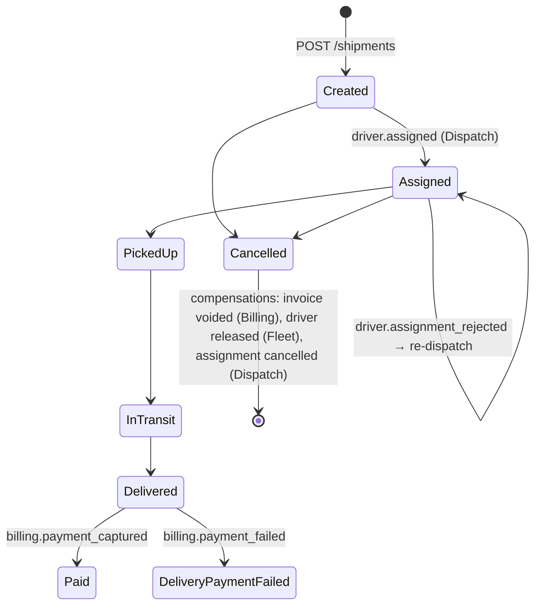

# Architecture

## 1. Bounded contexts and why they are split this way

| Context | Core question it answers | Its model of a "driver" |
|---|---|---|
| Shipping | *Where is this shipment in its lifecycle?* | A `DriverId`, nothing more |
| Fleet | *Who works for us, with what vehicle, and can they work right now?* | Full `Driver` aggregate: name, phone, vehicle, availability |
| Dispatch | *Who should carry this shipment?* | Its own `Driver`: capacity, availability, last assignment (built from Fleet events) |
| Billing | *How much does it cost, and has it been paid?* | Not needed |
| Notifications | *What do we tell the customer, and how?* | The driver's name only (from `driver.assigned`) |
| Analytics | *How is the operation performing?* | Not needed |

The same word ("driver") has a different model in each context. That is the point of bounded contexts, and
the reason there is **no shared domain model**. The only shared code is:

- `SharedKernel`: `Entity`, `AggregateRoot`, `IDomainEvent`, the exceptions and `IUnitOfWork`. These are primitives, not business concepts.
- `Contracts`: the published language (integration events). They are DTOs with primitive types, grouped by the context that owns them.
- `Messaging` and `ServiceDefaults`: technical infrastructure with no business knowledge.

The architecture tests fail the build if any service references another service's assemblies.

## 2. Inside a service

```text
Deliver.Shipping.Api             Composition root, minimal-API endpoints (thin)
   │
Deliver.Shipping.Infrastructure  EF Core DbContext + mappings, repositories, read stores, messaging wiring
   │
Deliver.Shipping.Application     Features/<UseCase>/ ← vertical slices: command/handler, event handlers, read DTOs
   │                             IntegrationEvents/  ← domain event → integration contract translation
Deliver.Shipping.Domain          Aggregates, value objects, domain events, repository interfaces
   │
Deliver.SharedKernel
```

Dependencies point inwards (Clean Architecture). Within the Application layer, code is organised by
**feature**, not by technical type, so a change to "cancel a shipment" touches one folder per layer.

Use cases are plain classes (`CreateShipmentHandler.HandleAsync`) resolved from DI. A mediator would add
indirection without solving a problem at this size, and MediatR is now commercially licensed.

**Notifications and Analytics are single projects.** They have no invariants to protect: one decides what
text to send, the other builds a read model. Four layers there would be ceremony, so the code is still sliced by
feature but not by layer. Choosing *where not to apply* a pattern is part of the design.

## 3. How a state change becomes a message

```text
HTTP POST /api/shipments
  → CreateShipmentHandler
      → Shipment.Create(...)                         raises ShipmentCreatedDomainEvent (in memory)
      → unitOfWork.SaveChangesAsync()
          → DomainEventsInterceptor.SavingChangesAsync
              → PublishShipmentIntegrationEvents.HandleAsync(ShipmentCreatedDomainEvent)
                  → outbox.Enqueue(new ShipmentCreatedIntegrationEvent(...))   adds an OutboxMessage row
          → INSERT shipments, shipment_items, outbox_messages   ◄── ONE transaction
  → 201 Created

OutboxProcessor (background, every second)
  → BEGIN; SELECT ... FROM outbox_messages WHERE processed_at IS NULL ... FOR UPDATE SKIP LOCKED
  → BasicPublish(exchange "shipment.events", key "shipment.created") and wait for the publisher confirm
  → UPDATE outbox_messages SET processed_at = now(); COMMIT
```

Failure analysis:

| Crash point | Outcome |
|---|---|
| Before the commit | Neither the shipment nor the event exists. Consistent. |
| After the commit, before publishing | The row stays unprocessed and is published on the next poll. |
| After the broker confirm, before `processed_at` is committed | **Published twice.** That is why every consumer is idempotent. |
| Broker down | The publish throws, `attempts`/`last_error` are recorded, and the batch stops (preserving order) and retries on the next poll. |

## 4. How a message is consumed

For each delivery on a service's queue ([`RabbitMqConsumer`](../src/BuildingBlocks/Deliver.Messaging/Consuming/RabbitMqConsumer.cs)):

1. Deserialize the envelope. If it's unreadable, `nack(requeue:false)` sends it via the queue's dead-letter exchange to `<queue>.dlq`.
2. Restore the correlation id and trace parent, so logs and traces continue the same flow.
3. `BEGIN` → `SELECT processed_messages WHERE message_id=@id AND consumer=@handler`. If found, skip it (a duplicate).
4. Run the handler (loads aggregates, applies behaviour, may enqueue outbox messages).
5. `INSERT processed_messages` → `COMMIT`. The business change, the outgoing events and the "processed" marker are atomic.
6. `ack`.

On an exception, the message is republished to `<queue>.retry.<n>`, a queue with a fixed TTL that dead-letters
back to the main queue, and `x-retry-count` is incremented. After the last tier the message goes to `<queue>.dlq`
with `x-exception-type`, `x-exception-message` and `x-failed-at` headers, and an error is logged. Only then is the
original acked, so a message is never lost between queues (the publisher confirm comes before the ack).

```text
             ┌──────────────── TTL 2s ───────────────┐
             ▼                                        │
  exchange → billing ──(fail #1)──► billing.retry.1 ──┘
             │  ▲
             │  └────────────────── TTL 10s ─────────────┐
             ├──(fail #2)──► billing.retry.2 ────────────┘
             ├──(fail #3)──► billing.retry.3 ─ TTL 30s ─► billing
             └──(fail #4)──► billing.dlq       (parked for a human)
```

Why tiered queues rather than one delay queue with per-message TTL: RabbitMQ only expires messages at the *head*
of a queue, so a 30-second message would block a 2-second one. One queue per delay avoids that, and needs no plugin.

**Ordering** isn't guaranteed across retries. Handlers are written to tolerate it:

- A missing prerequisite (e.g. `ShipmentDelivered` before Billing has seen `ShipmentCreated`) throws, and the retry resolves it.
- Dispatch ignores availability facts older than the last one it applied.
- Analytics fills per-event timestamps and derives the status, so arrival order doesn't matter.

## 5. The delivery saga

The workflow spans four services and has no distributed transaction. It is a **choreographed saga**: each
service reacts to the previous step's event and publishes its own.



Compensations and conflict handling:

| Situation | Who handles it | How |
|---|---|---|
| Customer cancels before pickup | Billing, Fleet, Dispatch | Void the invoice, release the driver, cancel the assignment |
| Dispatch's copy of availability is stale (the driver went offline in the meantime) | Fleet → Dispatch | Fleet *rejects* the assignment (`driver.assignment_rejected`). Dispatch remembers the rejection and picks the next driver. Shipping accepts a re-assignment before pickup. |
| Nobody is available | Dispatch | The assignment stays `Pending`, and the next `driver.available` gives that driver the oldest pending shipment that fits their vehicle |
| Payment declined | Billing → Shipping → Notifications | `billing.payment_failed` → `shipment.delivery_payment_failed` → the customer is asked to update the payment method |
| The same `ShipmentDelivered` is delivered twice | Billing | Inbox (same message id), then the aggregate guard (`Invoice` already paid), then the provider idempotency key (the invoice id) |

Why not an orchestrator: see [ADR-0007](decisions/0007-choreographed-delivery-saga.md).

## 6. Data ownership

One PostgreSQL server in development, but six databases, each owned by its own role, with `CONNECT` revoked
from `PUBLIC` ([init.sql](../deploy/postgres/init.sql)). The Dispatch service literally cannot open the
Fleet database. Cross-context data flows only as events into **local projections**:

- Dispatch keeps `drivers` (id, name, capacity, availability) from `driver.*` events.
- Notifications keeps `shipment_recipients` (shipment → customer) from `shipment.created`.
- Analytics keeps `shipment_facts` from `shipment.*` and `billing.payment_captured`.

## 7. Observability

- **Traces**: OpenTelemetry for ASP.NET Core, HttpClient and Npgsql, plus a custom `Deliver.Messaging` source.
  The `traceparent` of the HTTP request is stored in the outbox row, used as the parent of the *publish* span,
  sent in the AMQP headers, and used as the parent of the *process* span in the consumer. A single trace in
  Jaeger therefore goes gateway → Shipping → outbox → RabbitMQ → Dispatch → outbox → RabbitMQ → Notifications.
- **Correlation id**: `X-Correlation-Id` is accepted or created at the edge, stored in every envelope, restored
  by consumers and added to every log scope. It is a business-level id that survives even where tracing is sampled away.
- **Logs**: structured JSON to stdout, with scopes (`CorrelationId`, `MessageId`, `EventType`), and also exported via OTLP.
- **Health**: `/health/live` (process) and `/health/ready` (database and RabbitMQ connection).

## 8. What would change for production

- Run migrations as a separate deployment step (a job or an init container), not at startup. See [ADR-0006](decisions/0006-database-per-service.md).
- Delete processed outbox and inbox rows after a retention period.
- Add a DLQ tool (inspect, fix, replay), and alerts on DLQ depth.
- Publish contracts as versioned NuGet packages owned by the producing team.
- Add authentication at the gateway and service-to-service (mTLS or tokens).
- Use a real payment provider with idempotency keys (the port is already shaped for this).
