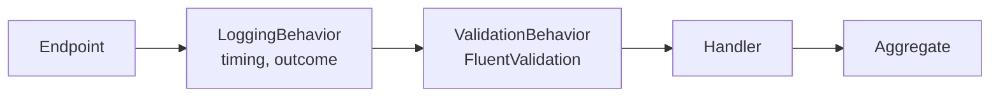

# Clean Architecture and vertical slices

## Layers, with dependencies pointing inwards

| Layer | Contains | May depend on |
|---|---|---|
| **Domain** | Aggregates, value objects, domain events, repository interfaces | SharedKernel only |
| **Application** | Use cases (commands and queries), validators, event handlers, ports | Domain, the messaging abstractions |
| **Infrastructure** | EF Core, repositories, read stores, RabbitMQ wiring | Application |
| **Api** | Minimal-API endpoints, composition root | Everything, to wire it up |

These rules are **tests**, not just a diagram: `Deliver.ArchitectureTests` inspects the compiled assemblies and fails
if, for example, a domain project references EF Core.

## Vertical slices inside the layers

Code is grouped by **feature**, not by technical type:

```text
Deliver.Shipping.Application/Features/
  CreateShipment/        CreateShipmentCommand + validator + handler
  ShipmentLifecycle/     PickUp / StartTransit / Deliver / Cancel
  GetShipment/           queries + read-store port + DTOs
  AssignDriver/          reacts to driver.assigned
  Billing/               reacts to price and payment events
```

Changing "cancel a shipment" touches one folder, not five.

## The MediatR pipeline

Endpoints send commands and queries through **MediatR 12.5**, the last Apache-2.0 release, pinned on purpose.
Every use case runs through the same pipeline:



- **Validation** checks the *shape* of the input and reports every field error at once (`400` with an `errors` map).
- **Aggregates** enforce the *invariants*. Removing a validator never makes the system incorrect.

## CQRS-lite

Commands load aggregates through repositories. Queries skip the domain entirely and read DTOs through
`I*ReadStore` interfaces implemented with `AsNoTracking` projections, because queries have no invariants to protect.

## Knowing when not to

Notifications and Analytics are **single projects** without MediatR. One decides what text to send, and the other
builds a read model; neither has invariants. Four layers there would be ceremony. Choosing where *not* to apply a
pattern is part of the design.
