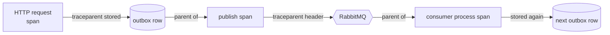

# Observability

In a distributed system, a single user action becomes a dozen messages across many processes. Without distributed
observability, "why wasn't this shipment assigned?" means reading six log files and guessing.

## One trace across asynchronous hops

HTTP calls propagate trace context automatically. Messages don't, especially through an outbox, where publishing
happens later on a background thread. Deliver bridges the gap explicitly:

The result in Jaeger is one trace: **gateway → Shipping → outbox → RabbitMQ → Dispatch → outbox → RabbitMQ → Notifications**.

## Correlation ids

`X-Correlation-Id` is accepted or created at the edge (the UI sends one per session), stored in every message
envelope, restored by consumers and added to every log scope. It is a business-level handle that survives even
where traces are sampled away.

## Structured logs

Every service writes JSON logs with scopes (`CorrelationId`, `MessageId`, `EventType`), so a log query like
`CorrelationId = "web-7f3c…"` returns the whole story across services. Retries log a warning with the attempt
number and delay. Dead-lettering logs an error.

## Health

- `/health/live`: is the process up?
- `/health/ready`: can it reach its database and RabbitMQ?

Liveness and readiness are separate so that an orchestrator wouldn't restart a healthy process just because a dependency is briefly down.
