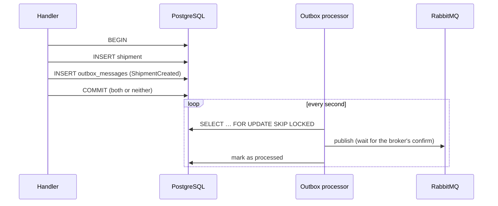

# Transactional outbox and idempotent inbox

## The dual-write problem

```text
save shipment to PostgreSQL   ✔
publish ShipmentCreated       ✘  broker unreachable, or the process crashes
```

The shipment exists, but nobody will ever price it or assign a driver. Publishing first has the opposite problem:
an event for a shipment that was rolled back. Two systems can't be written atomically.

## The outbox



- Aggregates raise domain events. An EF Core interceptor translates them into outbox rows **in the same transaction**.
- The processor marks a row as sent only **after the broker confirms** it.
- `FOR UPDATE SKIP LOCKED` lets several instances of a service share the work safely.
- If RabbitMQ is down, rows simply wait, and nothing is lost.

The trade-off: a crash between the broker's confirm and the database update publishes the message **again**.
Delivery is *at-least-once*, which is why consumers must be idempotent.

## The inbox

Each consumer runs the whole thing in one transaction:

```text
BEGIN
  already in processed_messages (message_id, consumer)?  → skip it
  run the handler (change aggregates, maybe write outbox rows)
  INSERT processed_messages
COMMIT
ack
```

The business change, the outgoing events and the "processed" marker are atomic. The composite primary key also
stops two instances processing the same message concurrently.

## Idempotency at the domain level too

The same *fact* can arrive with a *different* message id (for example, a producer bug). So aggregates are
idempotent where it matters: an `Invoice` that is already paid refuses to be charged again, and assigning the same
driver twice is a no-op. The payment provider receives the invoice id as an idempotency key, which covers the one
side effect outside the database.

This is tested with real containers: publish the same `ShipmentDelivered` three times, then assert **exactly one** payment attempt.
