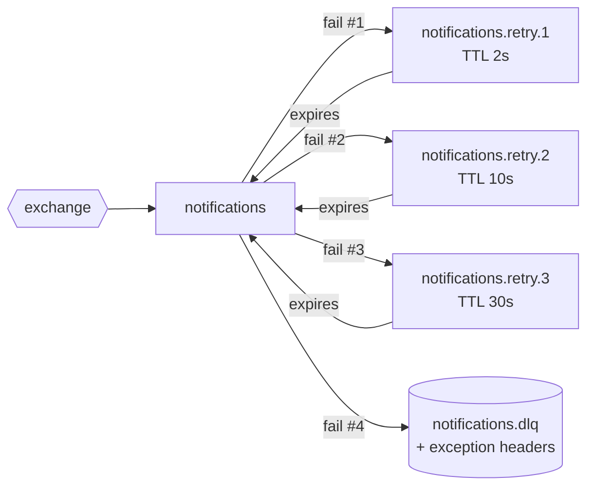

# Retries and dead-letter queues

Consumers fail. Sometimes the cause is **transient** (a database blip, a provider timeout, an event arriving before its
prerequisite), and sometimes it's **permanent** (a bug, a poison message). Requeueing immediately creates hot loops,
and dropping the message loses data.

## Tiered delay queues

- A failed message is republished to the next tier with `x-retry-count + 1`, and the original is acked only after the broker confirms.
- Each tier is a queue with a fixed `x-message-ttl` that dead-letters back to the main queue.
- After the last tier, the message is parked in `<queue>.dlq` with `x-exception-type`, `x-exception-message` and `x-failed-at`, and an error is logged.
- Unreadable messages are rejected, and the broker routes them straight to the DLQ.

**Why one queue per delay?** RabbitMQ expires messages only at the head of a queue. With a single delay queue, a
30-second message would block a 2-second one behind it.

## See it happen

The fake notification provider can simulate failures for two demo customers:

- **Flaky** fails twice and then succeeds, so the message is retried and processed once.
- **Unreachable** always fails, so the message ends up in `notifications.dlq`.

Both paths run in CI on every push, and you can trigger them from the UI's customer selector.

## Ordering

A retried message can be processed after newer ones, so handlers are written to tolerate reordering. A missing
prerequisite throws and is retried later. Dispatch ignores availability updates older than the last one it applied.
Analytics derives the status from timestamps, whatever order they arrive in.
