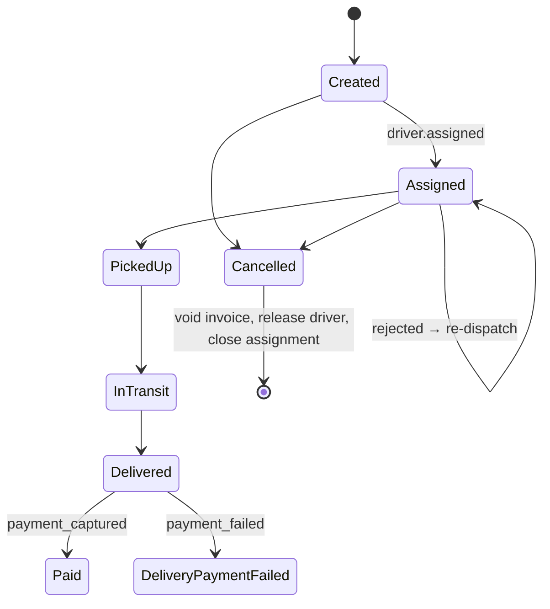

# Sagas and eventual consistency

## A workflow without a distributed transaction

Delivering and charging for a shipment spans Shipping, Dispatch, Fleet and Billing. A distributed (two-phase)
transaction across four databases and a broker is neither practical nor desirable. Instead, the workflow is a
**saga**: a sequence of local transactions, each publishing an event that triggers the next, with **compensations**
for the unhappy paths.



## Choreography, not orchestration

Each service reacts to the previous step's event. There is no central coordinator.

| | Choreography (used here) | Orchestration |
|---|---|---|
| Coupling | Low: nobody knows the whole flow | A central component knows every service |
| Visibility | Spread out (mitigated by docs and tracing) | In one place |
| Best for | Short, linear flows with obvious owners | Many branches, timeouts, human steps |

The flow here is linear, so choreography wins. A requirement like *"no driver after 30 minutes → escalate"* would be
the trigger to introduce a process manager.

## Compensations

| Situation | Reaction |
|---|---|
| The customer cancels before pickup | Billing voids the invoice, Fleet frees the driver, Dispatch closes the assignment |
| The driver was no longer available | Fleet rejects the assignment. Dispatch remembers the rejection and picks the next driver |
| The payment is declined | Shipping records `DeliveryPaymentFailed`, and the customer is asked to update the payment method |

## Eventual consistency, made visible

Right after `POST /api/shipments` the shipment has **no price yet**, because Billing hasn't processed the event.
A moment later it does. Rather than hiding this, the UI shows *"Billing is pricing it"* and keeps polling.

```jsonc
{ "status": "Created", "price": null }            // immediately
{ "status": "Assigned", "price": 13000 }          // ~100 ms later
```

This is the price of independence: Shipping stays available even when Billing is down.
