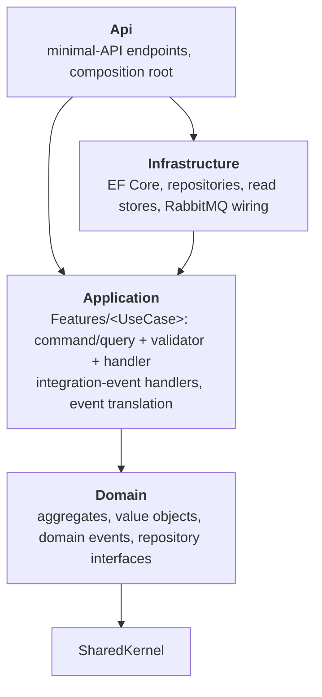
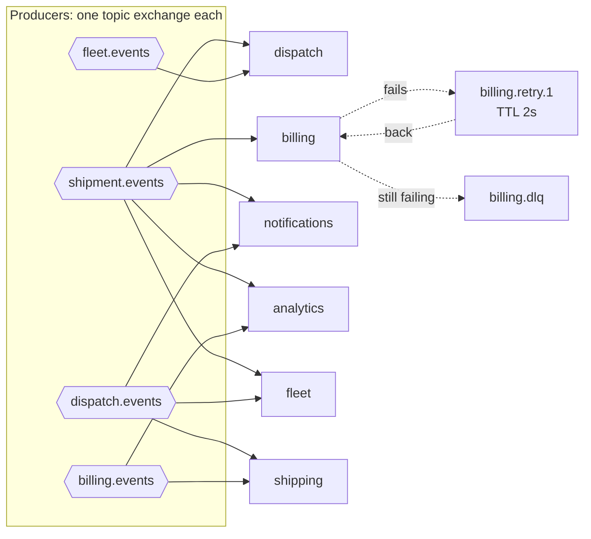

# Architecture

## Bounded contexts

| Context | Owns | Publishes | Reacts to |
|---|---|---|---|
| **Shipping** | Shipments and their lifecycle | `shipment.created`, `.assigned`, `.picked_up`, `.in_transit`, `.delivered`, `.cancelled`, `.delivery_payment_failed` | `driver.assigned`, `billing.price_calculated`, `billing.payment_*` |
| **Fleet** | Drivers, vehicles, availability | `driver.available`, `driver.unavailable`, `driver.assignment_rejected` | `driver.assigned`, `shipment.delivered`, `shipment.cancelled` |
| **Dispatch** | Matching shipments to drivers | `driver.assigned` | `shipment.*`, `driver.*` |
| **Billing** | Prices, invoices, payments | `billing.price_calculated`, `billing.payment_captured`, `billing.payment_failed` | `shipment.created`, `.delivered`, `.cancelled` |
| **Notifications** | What the customer is told | nothing | shipment events, `driver.assigned` |
| **Analytics** | A reporting read model | nothing | shipment events, `billing.payment_captured` |

The same word means different things in different contexts. Fleet's `Driver` has a phone, a vehicle and a
shift. Dispatch's `Driver` is just *capacity, availability and when they were last assigned*, and it is built from
Fleet's events. This is why there is **no shared domain model**, and why the architecture tests fail the build if
one service references another service's code.

## Inside a service



- **Dependencies point inwards.** The domain knows nothing about EF Core, ASP.NET Core or RabbitMQ.
- **Vertical slices.** A use case (`CreateShipment`) lives in one folder: its command, validator and handler.
- **Pragmatism.** Notifications and Analytics have no business invariants, so each is a single project, still organised by feature.

## Data ownership

Every service has its **own PostgreSQL database and its own login**. The init script revokes `CONNECT` from everybody
else, so Dispatch *cannot* open the Fleet database even by mistake. When a service needs another context's data,
it keeps a **local projection** fed by events:

| Service | Projection | Built from |
|---|---|---|
| Dispatch | available drivers and their capacity | `driver.available` / `driver.unavailable` |
| Notifications | which customer owns each shipment | `shipment.created` |
| Analytics | one fact row per shipment | all `shipment.*` events and `billing.payment_captured` |

## Messaging topology



Every consuming service has one durable queue, bound to the routing keys it cares about, plus its retry tiers and a
dead-letter queue. Messages share one envelope: `messageId`, `eventType`, `occurredAt`, `correlationId` and `payload`.

## Repository layout

```text
src/
  ApiGateway/                    YARP: routing only
  BuildingBlocks/                SharedKernel, Contracts, Messaging, Application.Pipeline, ServiceDefaults
  Services/<Context>/            Domain / Application / Infrastructure / Api
frontend/                        React control tower
tests/                           unit, architecture, contract, integration
deploy/                          Dockerfile, docker-compose.yml, postgres init
docs/                            architecture, event catalogue, ADRs
website/                         this site
```
