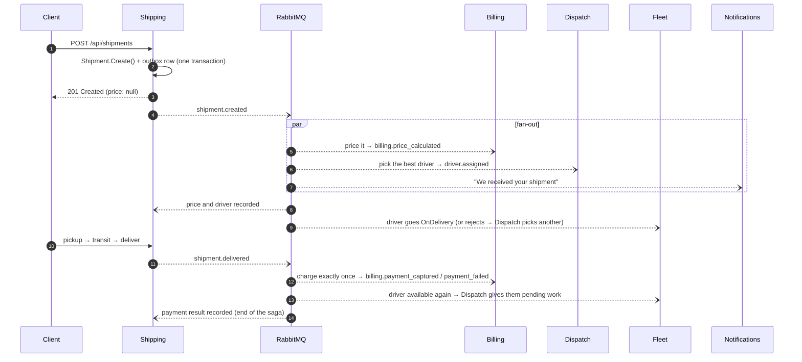

# Life of a shipment

This page follows one shipment through the system, and shows which service does what, and when.

## 1. Creation returns immediately

`POST /api/shipments` goes through the gateway to Shipping. The MediatR pipeline logs and validates the command,
the `Shipment` aggregate checks its invariants and raises `ShipmentCreatedDomainEvent`, and **the shipment and its
outgoing event are saved in the same database transaction** (the transactional outbox). The client gets `201`
without waiting for anybody else.

## 2. Three services react in parallel

- **Billing** prices the delivery (a base fee, plus every started kilogram, plus extra items) and publishes the price.
- **Dispatch** opens a `DeliveryAssignment` and chooses a driver: available, with enough vehicle capacity, and
  waiting longest since their last job. If nobody fits, the assignment waits until a `driver.available` arrives.
- **Notifications** records which customer owns the shipment and sends the first message.

## 3. Conflicts are resolved with events, not locks

Dispatch decides using its **own copy** of availability, which can be a few milliseconds stale. Fleet has the
final word: if the driver has just gone off shift, Fleet publishes `driver.assignment_rejected`, and Dispatch
remembers the rejection and picks the next driver. Shipping accepts re-assignment until pickup.

## 4. Delivery triggers payment, exactly once

`shipment.delivered` fans out again. Billing charges the customer, and duplicate protection is layered:

1. The **inbox** ignores a message id it has already processed.
2. The **`Invoice` aggregate** refuses to be charged twice, even when the same fact arrives with a different id.
3. The **payment provider** receives the invoice id as an idempotency key.

## 5. Every ending is handled

| Outcome | What happens |
|---|---|
| Paid | `billing.payment_captured` → the shipment's payment status becomes `Captured`, and Analytics counts the revenue |
| Declined | `billing.payment_failed` → Shipping publishes `shipment.delivery_payment_failed` → the customer is asked to update the payment method |
| Cancelled before pickup | Compensations: Billing voids the invoice, Fleet frees the driver, Dispatch closes the assignment |
