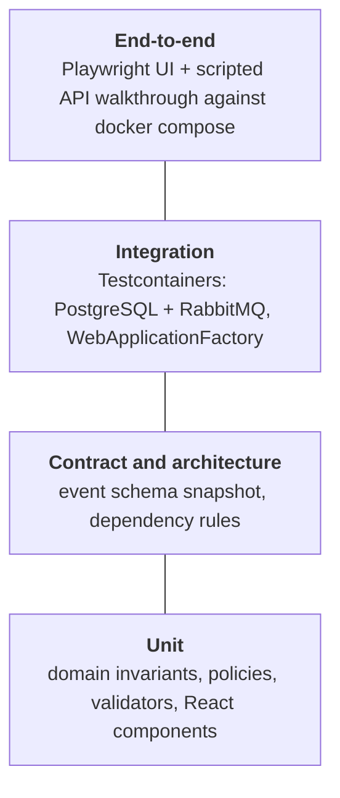
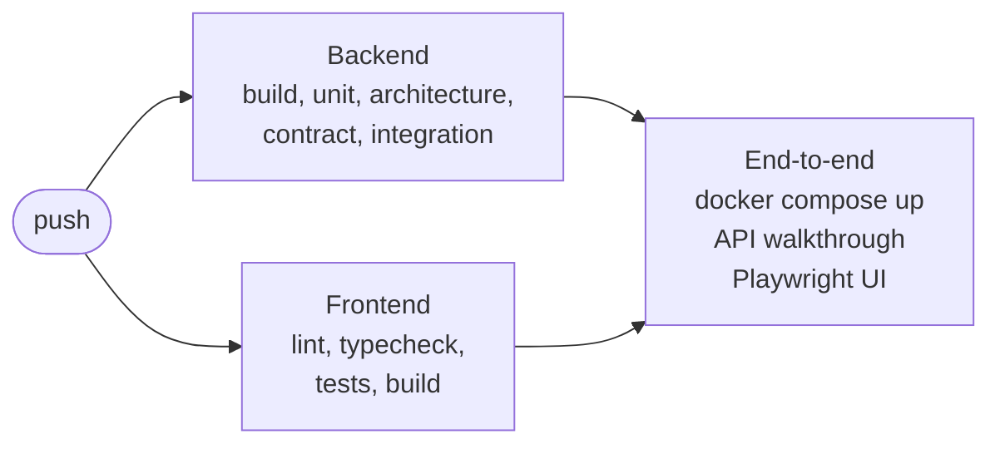

# Testing and CI

| Suite | What it proves |
|---|---|
| **Domain unit tests** | *A shipment cannot be picked up before assignment*, *cannot be delivered before pickup*, *cannot be cancelled once the driver has it*. *A driver cannot be assigned when unavailable*. *A customer is never charged twice*. The pricing rules and the driver-selection policy. |
| **Validation tests** | Every malformed field is reported at once, and the pipeline stops invalid commands before the handler runs. |
| **Architecture tests** | The domain has no EF Core, ASP.NET Core or RabbitMQ. The application layer has no infrastructure. **No service references another service.** Aggregates have no public setters. |
| **Contract tests** | Integration events are immutable, use primitive types only, have unique routing keys on their owner's exchange, and match the approved schema snapshot. |
| **Messaging integration** | A transient failure is retried with a delay and processed once. A permanent failure lands in the DLQ after N attempts. Poison messages are dead-lettered. Duplicates are ignored. Uncommitted work publishes nothing. |
| **Service integration** | HTTP → database → outbox → RabbitMQ with the correlation id preserved. A duplicated `DriverAssigned` assigns once. A duplicated `ShipmentDelivered` charges once. A declined payment publishes `PaymentFailed`. Cancellation voids the invoice. |
| **Frontend component tests** | Pending states while other services have not answered yet, and composing data from several contexts. |
| **End-to-end** | The whole Definition of Done against the real containers, both through the API and through the UI. |

## The pipeline

Every push runs all of it on GitHub Actions. The end-to-end stage builds every container, starts the system, and
fails if any step of the Definition of Done doesn't hold.
